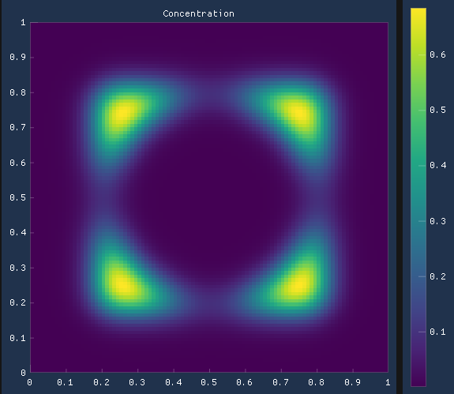
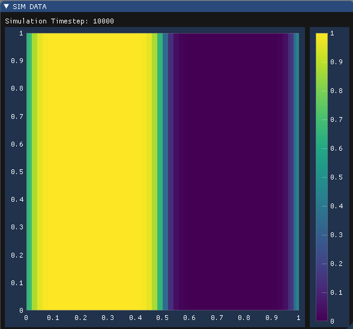

# 2D-Simulation Framework with live viewing written in C++
This is a framework for implementing 2D scalar field evolution algorithms and viewing them in real time using [Dear ImGui](https://github.com/ocornut/imgui) and the plotting library [ImPlot](https://github.com/epezent/implot).

## Updates
- Diffusion simulation is working
- Phasefield Simulation working
- Infile Parsing Done

## TODOS:
1. add Guide to infile creation
1. Implement persistence (write_timesteps and end file format (also, file reader -> Plotting with matplotlib or *implot*?))
5. Add visual/console mode to infile parsing -> only makes sense after persistence is implemented
3. Create documentation with doxygen
--- 

## Infile Parsing:
Using infiles to input initial scalar fields, more complex simulations have become possible. 
Applying gaussian smoothing to the domain after setting geometry may fix some artifacts.
Example infiles, and a guide on infile syntax (coming soon) can be found in [src/infile](https://github.com/Brudihawo/sim2d_cpp/tree/main/src/infile).

We now can make stuff like this:




## Implementing a new Simulation Domain Type

To simulate scalar field evolution, we need **two** things:
1. A way to define the initial condition of our scalar fields, and 
2. a description of how to create future values of the scalar field depending on the current state.

### Initialising the Simulation Domain

1. In `parsing/parse_simulationtype.cpp` Define a function that takes in an `std::ifstream`, identifies the parameters you want to parse from the infile and writes them to the 
`additional_params`vector. Make sure to seek to the beginning of the infile before iterating over the lines. Define print statements for missing parameters for better debugging.
2. Make that function accessible through a `parsing/parse_simulationtype.h`.

**parse_concentration.cpp**
```cpp
bool parse_concentration(std::ifstream& infile, std::vector<double>& additional_params) {
    std::string line;

    std::regex d_regex("D\\s*=\\s*(\\d+.\\d+)\\s*");
    std::smatch m;

    // go to beginning
    infile.clear();
    infile.seekg(0, std::ios::beg);
    while (std::getline(infile, line)) {
        if (std::regex_match(line, m, d_regex)) {
            if (additional_params.size() < 1)
                additional_params.push_back(std::stod(m[1], nullptr));
            return true;
        }
    }

    std::cout << "Missing declaration of domain parameters:" << std::endl;
    std::cout << "D" << std::endl;

    return false;
}
```

Note that the `parse_simulationtype` function must return `true` if all parameters have been found in the infile, and `false` if parameters are missing.

3. In `container.h`, add a simulation type to the `SimTypes` enum class.

**container.h**
``` cpp
enum class SimType {
    NONE = -1,
    CONCENTRATION,
    PHASEFIELD,
    // ...
};
```
3. In `parsing/parse_infile.cpp`, add code in `bool parse_infile` to support your infile parameters, after all previously defined simulation types.

**parse_infile.cpp**
```cpp        
if (simtype == SimType::CONCENTRATION) {
    if (parse_concentration(infile, additional_params)) {
        std::cout << "Found all parameters for concentration domain!" << std::endl;
        std::cout << "Creating domain..." << std::endl;
        domain = new ConcentrationDomain(params, additional_params);
    }
    else {
        std::cerr << "Error parsing concentration domain values! Aborting..." << std::endl;
        infile.close();
        return false;
    }
}
```
#### Creating a new Simulation Domain class
Now that we have enabled setting our domain's initial conditions, we can make it evolve over time. To do this, we implement our own simulation domain class.
A new simulation domain class needs to implement the functions `bool timestep(long t)`, and add basic domain information in its constructor. I recommend defining a reference to the scalar field and a previous version of the scalar field as a member variable to improve readability.

**concentration_domain.h**
``` cpp
class ConcentrationDomain : public SimulationDomain {
    private: 
        std::vector<double>& c; // Concentration scalar field
        std::vector<double>& old_c; // Previous timestep concentration values;
        double D; // Diffusion Coefficient
    
    public:
        ConcentrationDomain(SimParams& p, std::vector<double> additional_params);
        ~ConcentrationDomain();
        bool timestep(long t) override;
};
```

The constructor initialises the superclass with the base simulation parameters and a number of scalar fields. In this case, one (the concentration field) is sufficient. Here, we also initialise constants (the diffusion coefficient), the current and previous state of the scalar field.
This is also where we insert field descriptors and value limits for our scalar fields.

**concentration_domain.cpp**
```cpp
ConcentrationDomain::ConcentrationDomain(SimParams& p,
                                         std::vector<double>& additional_params):
        SimulationDomain(p, 1), D(d[0]),
        c(fields[0]), old_c(old[0]) {
    field_descriptors.push_back("Concentration");
    field_value_limits.push_back({ 0.0, 1.0 });
}
```
`bool timestep(long t)` specifies how the scalar field (or fields) evolve per timestep. `long t` is passed to this function to specify the simulation endpoint by returning `false`. You might also want to check for stationary states and use that as a cancelling condition.
```cpp
bool ConcentrationDomain::timestep(long t) {
    for (int i = 0; i < NX * NY; i++) {
        old_c[i] = c[i];
    }
    for (int j = 0; j < NY; j++) {
        for (int i = 0; i < NX; i++) {
            c[idx(i, j)] = old_c[i] + D * (d2dx(c, i, j) + d2dy(c, i, j)) * DELTA_T;
        }
    }
    return t < N_TIMESTEPS;
}
```

This domains `init()` function creates half of the domain with c=1, the other half with c=0. A simulation frame can look something like this:

